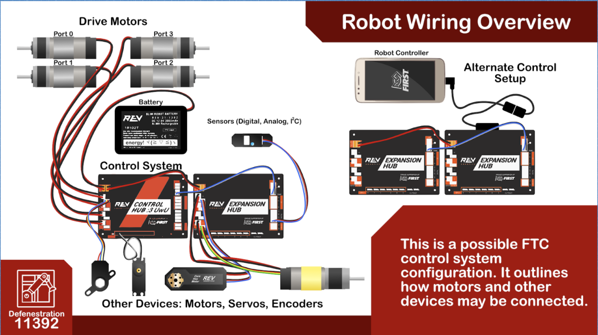

### The FTC Control System
------------ | -------------
REV Control System/Expansion Hub | Battery
Camera | Motor/Encoder
Servo | Sensors (Color, Distance, Limit, Touch)
Phone | Gamepad

| Syntax      | Description |
| ----------- | ----------- |
| Header      | Title       |
| Paragraph   | Text        |

### FTC Control System Example - Skystone

